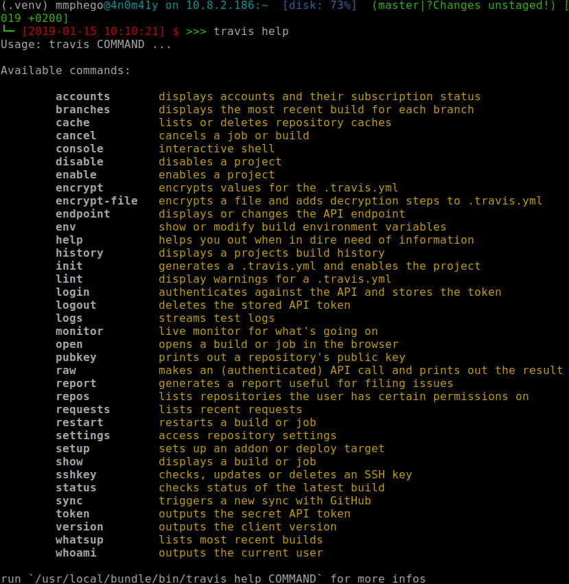

# Dockerized Travis Client


Simplified [travis-client](https://github.com/travis-ci/travis.rb#readme) to interface with a [Travis CI](travis-ci.org) service running on a Docker container, because installing ruby and gems plug-ins and making everything run smoothly isa pain!

## Usage
Assuming Docker is installed.

### Install travis
Either install `travis` shell script in `/usr/local/bin` or run from `cwd`.

```shell
make install # That's it!!!
```
### Build image

```shell
make build
```
Or just execute `make help`

### To Run

```shell
travis help
```



## Feedback

Feel free to fork it or send me PR to improve it.